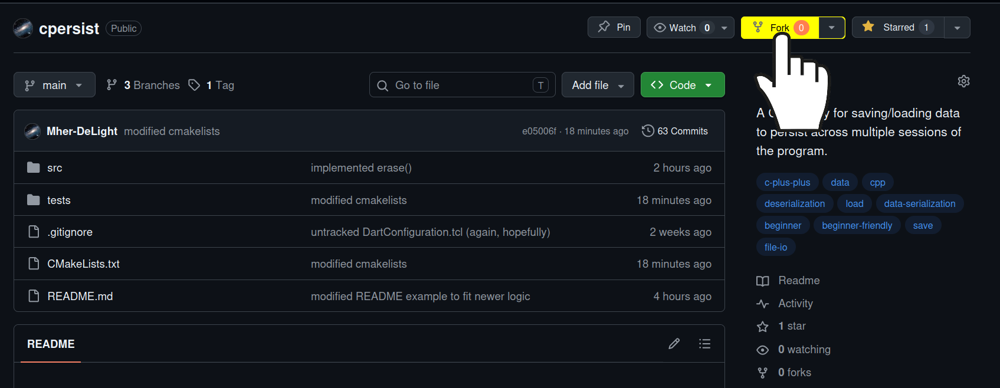

<div align="center">
    <a href="https://github.com/Mher-DeLight/cpersist/blob/main/README.md">
        
    </a>
</div>


## Contribution Guidelines
As the repository is currently maintained by one person (hello, that's me!) there aren't any strict guidelines for contributing. I'd be really happy if you fix any bugs you can spot. Write with K&R style, and try to fit the general style of the code around it. If possible, please use clang-format, as the configuration file is provided with the project.

## Contributing Guide
Assuming you're on GitHub, you must first fork the repository to your own account by pressing the fork button. 

After that, go to the directory where you want to do your edits and run:
```bash
git clone https://github.com/YOUR-GITHUB-USERNAME/cpersist
```
This will download the code into your device. Then run:
```bash
git remote add upstream https://github.com/Mher-DeLight/cpersist
git switch -c thing-youre-adding
```
This will create a new branch. You should name the branch based on the feature you're adding such that it is easy to tell what it's supposed to do. Making a new branch will make it that your changes don't directly affect the main branch if you mess something up. Make sure that, at the time you're committing, `BUILD_TESTS` in CMakeLists.txt is set to `OFF`. You can set it by passing `-DBUILD_TESTS=ON` to the compilation command, but please do not modify it from the CMakeLists.txt directly.

After that, you should make your changes. During those changes, you should periodically commit your changes via:
```bash
git add -A
git commit -m "commit message here"
```
When you finish adding and testing your features, commit once again with the commands above, then run:
```bash
git push origin thing-youre-adding
```
After that, go to GitHub again and open your fork's page. You will see a button labeled "Compare & pull request". Press it. Then describe what you changed, and if you fixed an issue, give the issue ID. Then I will personally review your pull request. I might ask for some changes, you should hopefully follow. Then you should push again and the PR will automatically update. Then eventually I will accept your PR and merge it into the repository.

### If you're using VSCode CMake Tools Extension
To configure the CPERSIST_BUILD_TESTS from the menu button, press Ctrl+, and type "cmake.options.advanced" into the search bar. Select the blue hyperlink that says "Edit settings.json" which will open a file. Append the following before the "cmake.options.advanced" field:
```json
"cmake.configureSettings": {
    "BUILD_TESTS": true
},
```
Save and exit the file. Then press Ctrl+Shift+P and type "CMake: Delete Cache and Reconfigure" and press enter. Now when you press the build button at the bottom, CPERSIST_BUILD_TEST will be set to ON.

## Project Structure
- `src/aes.cpp` - Handles AES-256 encryption with the `encrMgr` object.
- `src/atomic.cpp` - Handles atomic file replacement. Has its own file because it requires platform-dependent information, which we don't like to include with the main project body.
- `src/cpersist.cpp` - Main implementations of Files, Stashes, Proxies, etc.
- `src/error_handler.cpp` - Handles errors. Minimal for now.
- `tests/game.cpp` - A simple CLI movement game to test persistence. Not included in any build option. Basically an artifact.
- `tests/test.cpp` - Unit tests handle via Google Test.
- `.clang-format` - clang-format configuration file.
- `CMakeLists.txt` - CMake configuration file.